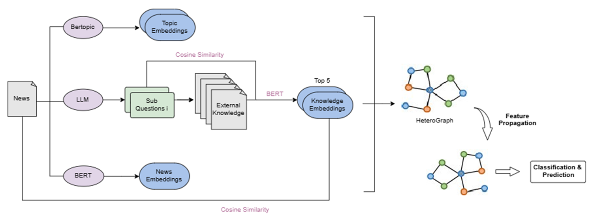

# Fake News Detection via RGCN

- Pipeline

- KnowRGFD_add_nonrelevant_edge : RGCN + External Knowledge Positive / Negative + node-wise layer gating

## Acknowledgements & Reference
- [LESS4FD/LESS4FD](https://github.com/LESS4FD/LESS4FD)
```
@inproceedings{ma-etal-2024-fake,
    title = "On Fake News Detection with {LLM} Enhanced Semantics Mining",
    author = "Ma, Xiaoxiao  and
      Zhang, Yuchen  and
      Ding, Kaize  and
      Yang, Jian  and
      Wu, Jia  and
      Fan, Hao",
    editor = "Al-Onaizan, Yaser  and
      Bansal, Mohit  and
      Chen, Yun-Nung",
    booktitle = "Proceedings of the 2024 Conference on Empirical Methods in Natural Language Processing",
    month = nov,
    year = "2024",
    address = "Miami, Florida, USA",
    publisher = "Association for Computational Linguistics",
    url = "https://aclanthology.org/2024.emnlp-main.31/",
    doi = "10.18653/v1/2024.emnlp-main.31",
    pages = "508--521",
    abstract = "Large language models (LLMs) have emerged as valuable tools for enhancing textual features in various text-related tasks. Despite their superiority in capturing the lexical semantics between tokens for text analysis, our preliminary study on two popular LLMs, i.e., ChatGPT and Llama2, showcases that simply applying the news embeddings from LLMs is ineffective for fake news detection. Such embeddings only encapsulate the language styles between tokens. Meanwhile, the high-level semantics among named entities and topics, which reveal the deviating patterns of fake news, have been ignored. Therefore, we propose a topic model together with a set of specially designed prompts to extract topics and real entities from LLMs and model the relations among news, entities, and topics as a heterogeneous graph to facilitate investigating news semantics. We then propose a Generalized Page-Rank model and a consistent learning criteria for mining the local and global semantics centered on each news piece through the adaptive propagation of features across the graph. Our model shows superior performance on five benchmark datasets over seven baseline methods and the efficacy of the key ingredients has been thoroughly validated."
}
```